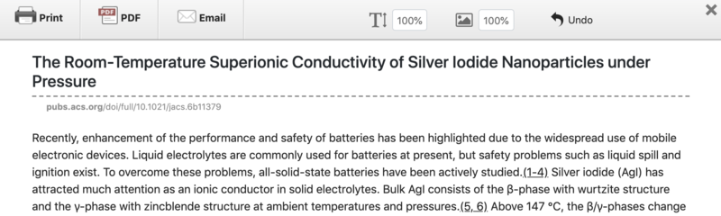

I love kindle but its 6-inch screen is torturous for reading paper. There're some softwares that can crop those double column papers into kindle screen size. One problem would be sometimes you will have single column abstract/figures in the double column paper, that makes the cropping result problematic. Another unsatisfying aspect is the cropped chunks are all images, not text, so you can not select the words when you read them on kindle. 

There's a tricky way to make us able to enjoy papers on kindle. For most published papers of recently years, when you go to the web page of the paper, you will find both buttons for its PDF and HTML versions, like Physical Review Letter (figure below), or, the HTML version is automatically loaded once you get access to the paper. Currently, I think almost all publishers have put the HTML version online together with the PDF file. (Only for those very old paper, from decades ago, can you only find PDF version)

Then looking at the HTML, you know what to do, because you can print HTML adapting to any page size that you want. In most cases, it works perfect with your browser printing, but sometimes the result seems to be funky, like below:

The navigator occludes the figures or text, or you might have ads on the left/right side. Then I want to introduce a powerful tool called printfriendly. It eliminates those useless content in the webpage and also makes you flexible to delete any module in the page. It provides a Chrome extension, so that you only need to click the icon each time you want to print paper. Then for the same paper as shown in the above figure, we get the following result:

Looks perfect! We just need to click "Print" button, and choose any paper size we want. I usually choose A5 and with scaling 100%-150% to fit my kindle, but you can adjust it flexibly. 
