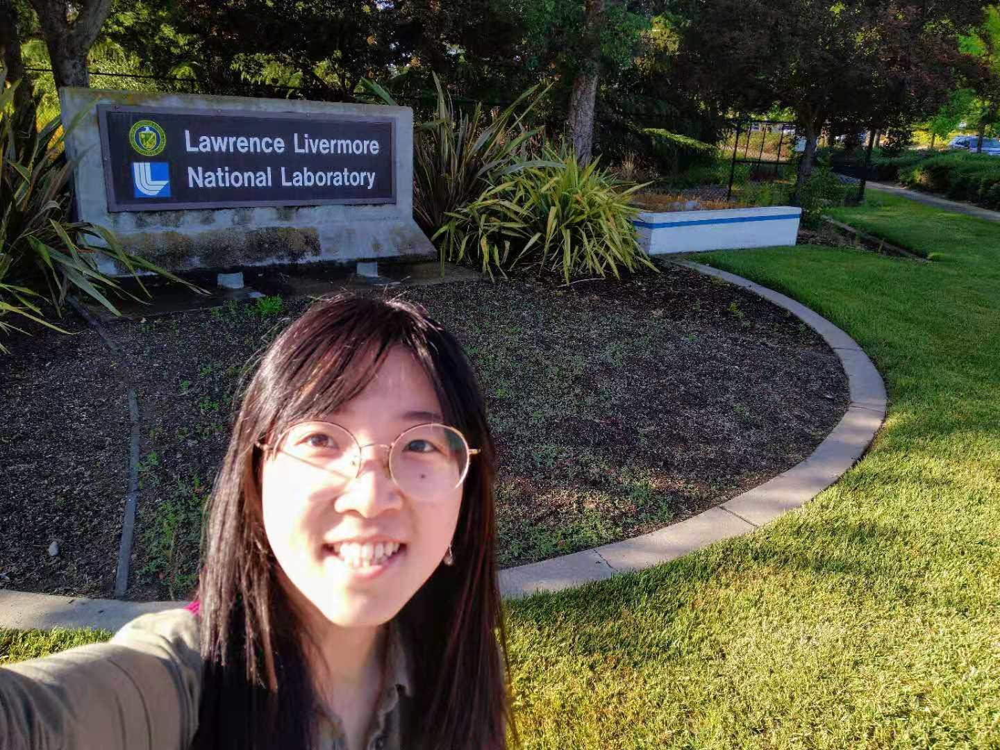

### 2021.6 - Return to the campus

Now we are allowed to go back to the office since most people are vaccinated. It's been one year!

### 2021.3.19 - The MGP paper is published!

After a half-year-long review, our paper is finally published on npj Computational Materials. Check it [here](https://www.nature.com/articles/s41524-021-00510-y)!

### 2020.4.30 - Passed qualification exam!

Congratulations to me! And thank you Prof.Kozinsky, Prof.Kaxiras, Prof.Li and Prof.Brenner for your questions and nice suggestions!

### 2020.3.27 - Pandemic quarantine

Harvard starts quarantine, and all classes go online

### 2020.2.29 - Went to Denver for APS March meeting & Returned to Boston within 24h

The whole group went to Denver on Saturday, having dinner in a really nice restaurant, and received the email saying APS got cancelled due to COVID-19. Stayed in Denver for less than 24h and got back to Boston.

### 2019.12.3 - The 1st presentation in my life @ MRS 2019 fall

Give a talk about my "Mappd Gaussian Process" project @ MRS.

### 2019.6 - Summer internship at Lawrence Livermore National Lab

Go to Livermore, California and do research there. California is a great place. I like the weather.

### 2019.5 - Switch program: Applied Math ➡️  Applied Physics

The CDH commitee of applied math suggested me to switch to applied physics since I've selected too many physics courses. I agreed to.

### 2018.8.4 - Arrive at Harvard and Participate in the ELP Program

Come to Harvard a month earlier than the 2018 fall semester begins, to take part in the 3-week English language program.
