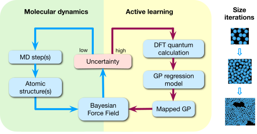
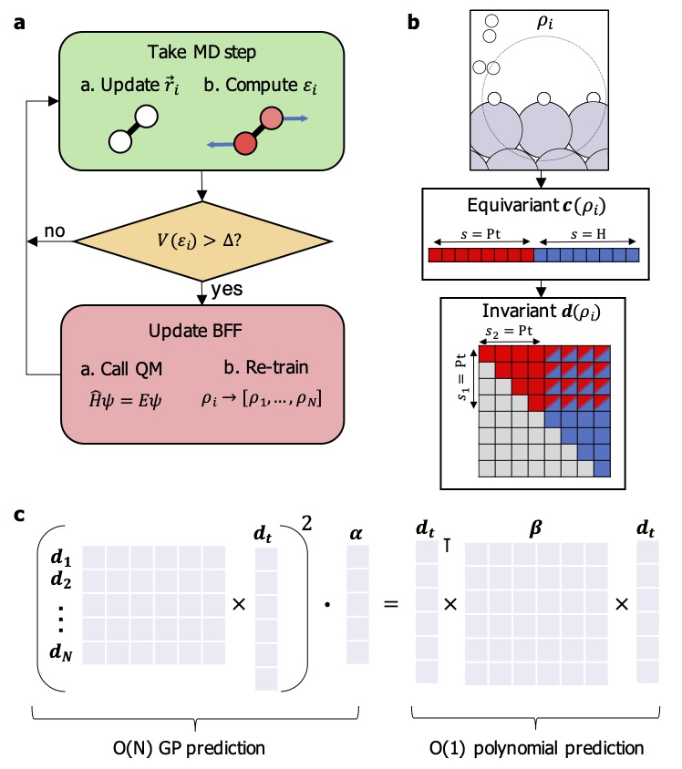
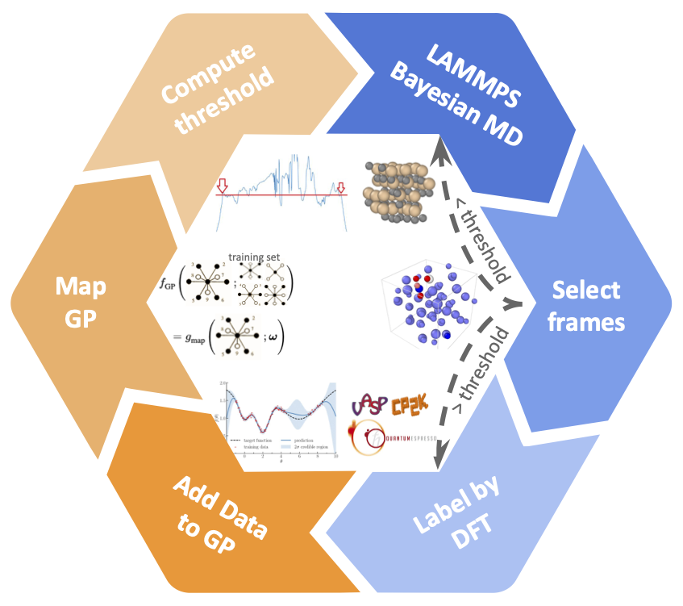
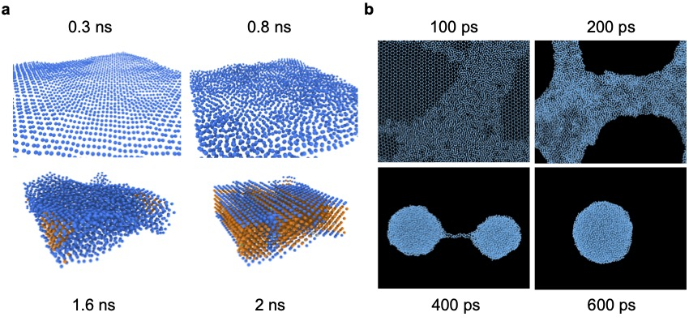

# FLARE

**Interatomic potential built by Gaussian process regression and Bayesian active learning**

Check our Python code here: https://github.com/mir-group/flare

# FLARE++

**High-performance C++ code for sparse Gaussian process (SGP) with atomic cluster expansion (ACE) descriptors**

Check our code here: https://github.com/mir-group/flare_pp

# Flightning

**FLARE high-speed active learning (with LAMMPS uncertainty) (<-- FLARE Lightning)**

Check our code here: https://github.com/mir-group/flightning

# Applications

## Stanene

Check our scripts here: https://github.com/YuuuXie/Stanene_FLARE

## Silicon carbide

